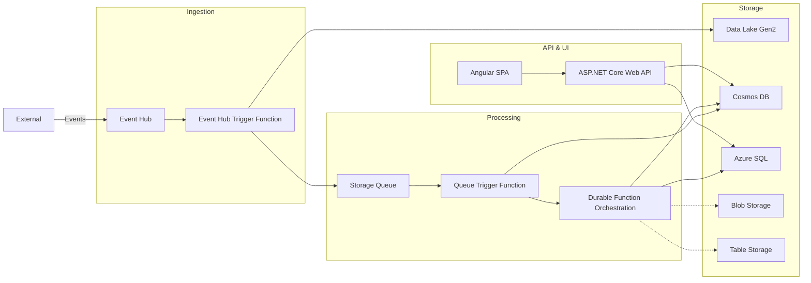

# Real‑Time Event Analytics Dashboard – Azure Mini Project

## Overview
A system that ingests high‑volume telemetry events (IoT sensor readings, clickstreams, etc.), processes them in real‑time, stores raw and aggregated data, and provides an Angular dashboard for monitoring and analytics. Demonstrates Azure services, .NET 10, and SOLID principles.

## Tech Stack
- **Backend** – C# / .NET 10 (Web API, Azure Functions – regular & durable)
- **Frontend** – Angular
- **Messaging** – Event Hubs, Storage Queues
- **Storage** – Azure SQL, Cosmos DB, Data Lake Gen2, Blob Storage, Table Storage

## Architecture Diagram

## Component Details
## 1. Event Hub (Ingestion)
- Receives raw JSON events.
- Partitioned for high throughput.
- Uses a consumer group for the trigger function.

## 2. Event Hub Trigger Function (Regular .NET 10 Isolated)
- Validates event schema.
- Writes raw event to Data Lake Gen2 (path: `/raw/{year}/{month}/{day}/{hour}/{deviceId}/{eventId}.json`).
- Enqueues a lightweight message to Storage Queue (event ID, partition key, timestamp).

## 3. Storage Queue
- Decouples ingestion from processing.
- Dead‑letter queue and visibility timeout configured.

## 4. Queue Trigger Function (Regular)
- Reads queue messages.
- Fetches raw event from Data Lake (by ID).
- Enriches event (geolocation, device validation).
- Writes processed event to Cosmos DB (partitioned by device ID).
- Optionally starts a Durable Function orchestration (e.g., anomaly detection).

## 5. Durable Functions Orchestration
- Long‑running, stateful workflow.
- Activities:
1. GetRecentEvents – query Cosmos DB (last 10 minutes).
2. DetectAnomaly – rule engine or ML model.
3. StoreAlert – write to Azure SQL.
4. SendNotification – email/SMS (mock).
5. Orchestration ID stored in Cosmos DB.

## 6. ASP.NET Core Web API (.NET 10)
- REST endpoints for the Angular frontend.
- Examples:
    - GET /api/events/{deviceId}?from=...&to=...
    - POST /api/alerts – trigger orchestration manually.
    - GET /api/dashboard/stats – summary from SQL.
- Uses managed identity for database access.
- Implements repository pattern & SOLID principles.

## 7. Storage Accounts
| Service | Purpose|
|-|-|
| Blob Storage | Angular static assets, user‑uploaded files (via SAS URLs).|
| Table Storage	| Audit logs, simple key‑value metadata.|
| Data Lake Gen2 | Raw event archive + partitioned Parquet files for analytics.|

## 8. Azure SQL
- Relational data: user profiles, alert rules, daily aggregated reports.
- Accessed by Web API and Durable Functions.

## 9. Cosmos DB (Core API)
- Operational store: processed events (low latency), device registry, orchestration checkpoints.
- Automatic indexing, TTL on raw payload.

## 10. Angular Frontend
- Dashboard: real‑time event chart (polling or SignalR), device table, alert history.
- File upload to Blob Storage (signed URLs).
- JWT authentication (Entra ID).

## Data Flow (End‑to‑End Example)
1. Event arrives → Event Hub → Trigger Function → raw event stored in Data Lake, message in Queue.
2. Queue processing → Function reads raw event from Data Lake → enriches → writes to Cosmos DB → (if anomaly) starts Durable Orchestration.
3. Durable Orchestration → activities read from Cosmos DB & SQL → store alert in SQL → log steps to Table Storage.
4. User views dashboard → Angular calls Web API → Web API queries Cosmos DB (live events) and SQL (aggregated alerts).
5. User uploads device image → Angular requests SAS URL → uploads to Blob Storage → metadata stored in Table Storage.

## SOLID Principles Applied
| Principle	| Example |
|-|-|
|SRP | Ingestion, enrichment, orchestration separated into different functions.|
|OCP | New event types added via enrichment strategy (DI) – no change to ingestion.|
|LSP | Repository interfaces (IEventRepository) implemented by Cosmos DB and SQL – interchangeable.|
|ISP | Web API controllers expose lean interfaces; storage clients split into IBlobStorage, ITableStorage.|
|DIP | Functions depend on IEventHubProcessor abstraction; Web API uses IDeviceService.|

## Azure Free Tier Eligibility
|Service | Free Tier | Limits|
|-|-|-|
|Azure Functions (Regular & Durable) | ✅ Always free | 1M executions / 400,000 GB‑s per month
|Web API (App Service) | ✅ Always free | 60 min CPU/day|
|Storage Queue / Blob / Table | ✅ 12‑month free | 5 GB LRS Hot Blob|
|Azure SQL Database | ✅ Always free | 100k vCore sec, 32 GB data|
|Cosmos DB | ✅ Always free | 1000 RU/s & 25 GB storage|
|Data Lake Gen2 | ❌ No free tier | Paid from day 1|
|Event Hubs | ❌ No free tier | Use $200 credit for dev/test|

## ADLS Gen2 Optimization (Keep, Not Replace)
- Lifecycle management – Move raw events: Hot (1d) → Cool (30d) → Cold (90d) → Archive (365d) → Delete.
- Partitioning – Use Hive‑style folders: /raw/year=2025/month=03/day=15/device_group=A/hour=10/
- Batched writes – Write 5–10 MB files (every 10 seconds or 500 events) instead of one file per event.
- Compression – Write as gzipped JSON or Parquet (reduces size 70–90%).
- Avoid real‑time reads – Enrichment function reads from queue payload (not ADLS) if payload ≤64 KB; ADLS becomes pure archive.
- Cost monitoring – Enable Storage Analytics logs, set budget alerts.

## Deployment & Operational Notes
- Resource Group – One group containing Event Hub Namespace, Function App, Storage Account, SQL Server, Cosmos DB, App Service, Static Web App (or Blob + CDN).
- Identity – User‑assigned managed identity for Functions and Web API. RBAC roles: Storage Blob Data Contributor, Cosmos DB Account Reader, SQL Contributor.
- Networking – Optional private endpoints.
- Monitoring – Application Insights integrated with Functions + Web API.
- Resilience – Event Hub checkpointing, Queue dead‑letter, Durable Functions replay safety.

## Next Steps / Implementation Roadmap
1. Provision Azure resources (or use local emulators for development).
2. Implement Event Hub trigger function with ADLS write and queue enqueue.
3. Implement queue trigger function with enrichment and Cosmos DB write.
4. Build Durable Functions orchestration (anomaly detection).
5. Create ASP.NET Core Web API (repositories, endpoints).
6. Develop Angular dashboard (chart, device list, alert history).
7. Integrate authentication (Entra ID).
8. Set up lifecycle management and cost alerts.
9. Load test with simulated event traffic.

Document version 1.0 – prepared for hand‑off to development team.