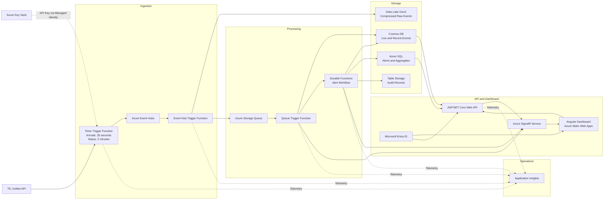
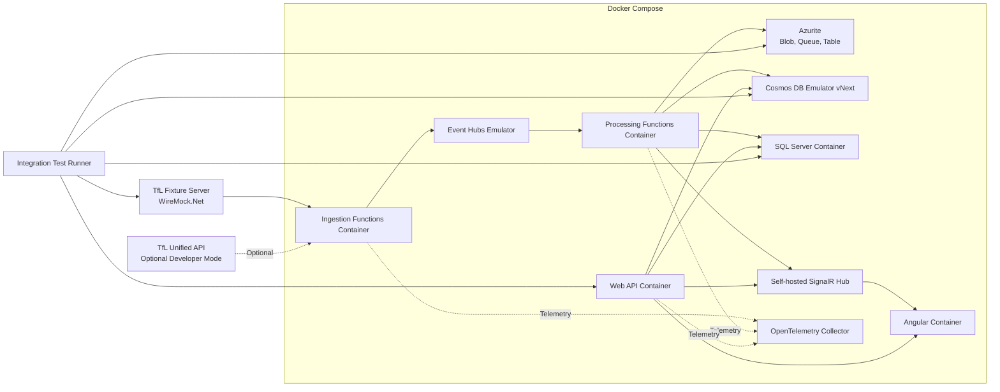

# TfL Live Analytics Azure Mini Project Plan

## Implementation Status

Phase 1 started on June 11, 2026 and completed on June 13, 2026. Phases 2 and 3
were completed on June 13, 2026.

Completed:

- Multi-project .NET 10 solution and Angular 21 live line-status dashboard.
- API, isolated Function hosts, contracts, application, infrastructure, and test
  project boundaries.
- Dockerfiles and validated Docker Compose configuration.
- Deterministic WireMock TfL fixture and successful container smoke test.
- Bicep modules for storage/ADLS, Key Vault, Event Hubs, Log Analytics, and
  Application Insights.
- Azure foundation deployment to `rg-tfl-analytics-dev-uk-south`.
- TfL and Datadog keys stored in `kv-tfl-nhkpyupi`.
- Two .NET 10 Flex Consumption Function Apps with managed deployment identities.
- Free Static Web App for the Angular dashboard.
- ASP.NET Core API deployed to Azure Container Apps Consumption from a private
  Basic Azure Container Registry.
- Azure API health and live TfL line-status smoke tests.
- Ingestion and processing Function packages deployed with public health checks.
- Angular dashboard deployed to Azure Static Web Apps with production API CORS,
  security headers, and live TfL line-status smoke tests.
- Cosmos DB free-tier account with shared throughput, seven-day TTL containers,
  and managed-identity data access.
- Azure SQL free-serverless database with Microsoft Entra-only administration
  and automatic pause when the monthly free allowance is exhausted.
- Azure SignalR Service Free F1 with key authentication disabled and
  managed-identity app-server access.
- Least-privilege Event Hubs and Key Vault workload RBAC for the API,
  ingestion, and processing identities.
- Selected low-volume diagnostic settings for Key Vault, Event Hubs, Cosmos DB,
  SignalR, and Azure SQL.
- GitHub Actions validation for .NET, Angular, Bicep, shell scripts, Docker
  Compose, secrets, and dependency vulnerabilities.
- Documented manual Azure deployment and rollback runbook.
- Versioned arrival and line-status observation contracts with deterministic
  event IDs.
- Typed TfL arrivals, stop metadata, and line-status client operations with
  bounded retries for transient failures.
- Configurable arrival and line-status timer-triggered polling.
- Event Hubs publication using the emulator connection string locally and
  managed identity in Azure.
- Deterministic WireMock fixtures and focused tests for polling, mappings,
  event IDs, and retry behavior.
- Key Vault-backed TfL API configuration for the Azure ingestion Function.
- Event Hub-triggered gzip raw-event archiving with Hive-style Blob paths.
- Storage Queue handoff with validation, normalization, retry, and poison queue
  behavior.
- Idempotent arrival and line-status persistence to partitioned Cosmos DB
  containers with seven-day TTL.
- A deterministic Docker full-run test covering WireMock, timers, Event Hubs,
  Blob Storage, Queue Storage, and Cosmos DB.
- Phase 3 deployed to Azure on June 14, 2026 and verified through live raw
  archives, queue processing, and Cosmos DB persistence.

Phase 4 alert processing was completed locally and deployed to Azure on
June 14, 2026. A controlled good-service-to-disruption transition verified the
complete Durable Functions, Azure SQL, Table Storage, and mock-notification
workflow.

Next delivery phase:

- Phase 5 API, SignalR, and dashboard work.

## Summary

Transform the existing generic telemetry project into a portfolio-grade TfL live
analytics platform. Azure Functions will poll TfL live arrivals every 30 seconds
and line status every 2 minutes, publish normalized events through Event Hubs,
store operational and historical data, detect delays and disruptions, and push
updates to an Angular dashboard through Azure SignalR Service.

The first release will monitor Tube data for these configurable stations:

| Station | NaPTAN ID |
|---|---|
| Victoria | `940GZZLUVIC` |
| Oxford Circus | `940GZZLUOXC` |
| Green Park | `940GZZLUGPK` |
| King's Cross St Pancras | `940GZZLUKSX` |
| London Bridge | `940GZZLULNB` |

The live TfL Swagger contract will be used instead of the legacy
`Tfl.Api.Presentation.Entities.dll`.

## Architecture Diagram



## Local Container Architecture

Most of the data path can run locally in Docker. Local integration tests will use
official Azure emulators where they exist and explicit development replacements
where Azure has no equivalent emulator.



### Local Service Matrix

| Azure production service | Local container or replacement | Coverage and limitation |
|---|---|---|
| Azure Functions | Custom Functions containers using the local Functions host | Runs triggers and bindings locally; Azure hosting, scaling, and managed identity behavior require cloud tests. |
| Event Hubs | Official Event Hubs emulator | Supports AMQP/Kafka producer and consumer flows. It does not emulate Entra ID, Capture, autoscale, geo-recovery, or Azure monitoring, and data is lost after restart. |
| Blob, Queue, Table Storage | Official Azurite container | Suitable for triggers, queues, raw blob archives, poison queues, and Durable Functions state. Table support remains preview. |
| Data Lake Gen2 | Azurite Blob endpoint through an archive abstraction | Tests payloads and partition paths, but not hierarchical namespace, DFS APIs, POSIX ACLs, or lifecycle policies. Those require Azure smoke tests. |
| Cosmos DB for NoSQL | Official Linux Cosmos DB emulator vNext | Runs in Docker and supports the NoSQL API in gateway mode. It implements only a subset of cloud features. |
| Azure SQL Database | SQL Server Linux container | Tests EF Core mappings, migrations, and queries. On Apple Silicon it uses `linux/amd64` emulation and may be slower. |
| Durable Functions | Local Functions host backed by Azurite | Tests orchestration, activity, retry, and idempotency behavior. Azure scale and hosting behavior require cloud tests. |
| Azure SignalR Service | Self-hosted ASP.NET Core SignalR for the normal application path | Preferred local replacement for Default mode. The Azure SignalR emulator is limited to serverless transient transport and may be used only for extension-specific tests. |
| Key Vault | Environment variables or mounted Docker secrets through `ISecretProvider` | Tests configuration flow, not Key Vault authentication, RBAC, rotation, or network controls. |
| Microsoft Entra ID | Development authentication handler issuing fixed test identities | Tests authorization policies and roles. Token validation and tenant configuration require cloud smoke tests. |
| Application Insights | OpenTelemetry Collector plus console/OTLP export | Tests trace and metric instrumentation. Azure ingestion, alert rules, and workbooks require cloud validation. |

### Compose Profiles

Provide the following Docker Compose profiles:

- `core`: Azurite, Event Hubs emulator, Cosmos DB emulator, SQL Server, TfL
  fixture server, Functions, and Web API.
- `ui`: adds Angular and the self-hosted SignalR path.
- `observability`: adds OpenTelemetry Collector and a local trace viewer.
- `live-tfl`: uses the real TfL API instead of fixtures and requires the TfL key
  from an uncommitted environment file.

The default integration-test profile must use deterministic recorded TfL fixtures,
not the live API. This avoids rate limits, network dependency, changing arrival
data, and accidental exposure of the TfL key.

### Local Configuration Boundaries

Application code must depend on interfaces rather than directly selecting cloud
or emulator endpoints:

- `IEventPublisher`
- `IRawEventArchive`
- `IEventRepository`
- `IAlertRepository`
- `IRealtimeNotifier`
- `ISecretProvider`
- `ITflApiClient`

Production configuration selects Azure SDK implementations and managed identity.
The local environment selects emulator endpoints, self-hosted SignalR, and
environment-backed secrets. Business logic and event contracts remain identical.

## Repository Structure

Expand the existing workspace into a multi-project solution:

```text
csharp/
|-- TflAnalytics.sln
|-- src/
|   |-- TflAnalytics.Api/
|   |-- TflAnalytics.Ingestion.Functions/
|   |-- TflAnalytics.Processing.Functions/
|   |-- TflAnalytics.Contracts/
|   |-- TflAnalytics.Application/
|   `-- TflAnalytics.Infrastructure/
|-- web/
|   `-- tfl-analytics-dashboard/
|-- infra/
|   |-- bicep/
|   `-- local/
|       |-- compose.yaml
|       |-- compose.integration.yaml
|       |-- eventhubs-config.json
|       |-- otel-collector.yaml
|       `-- .env.example
|-- tests/
|   |-- TflAnalytics.UnitTests/
|   |-- TflAnalytics.IntegrationTests/
|   `-- TflAnalytics.AzureSmokeTests/
`-- docs/
    `-- AzureRealTimeEventAnalytics.md
```

The existing ASP.NET Core project will become `TflAnalytics.Api`. Shared event
contracts and DTOs will live in `TflAnalytics.Contracts`; external service and
storage implementations will live in `TflAnalytics.Infrastructure`.

## Event Flow

1. A timer-triggered Function requests arrival predictions for the configured
   stations every 30 seconds and line status every 2 minutes.
2. The Function wraps each response in a versioned event envelope and publishes
   it to Event Hubs.
3. An Event Hub-triggered Function archives the raw JSON in Data Lake Gen2 and
   places a lightweight processing message on Storage Queue.
4. A Queue-triggered Function validates, normalizes, and deduplicates the event.
5. Current and recent events are written to Cosmos DB.
6. Arrival and status updates are broadcast to connected Angular clients using
   SignalR.
7. Qualifying delays and disruptions start a Durable Functions orchestration.
8. The orchestration writes alert records to Azure SQL, audit records to Table
   Storage, and broadcasts the alert through SignalR.
9. The Web API queries Cosmos DB for live data and Azure SQL for alerts and
   aggregates.

The current implementation completes steps 1 through 5 and the alert portions
of steps 7 and 8. SignalR publication and API query paths remain planned for
Phase 5.

## Event Contracts

Use a common event envelope:

```json
{
  "eventId": "deterministic-event-id",
  "eventType": "ArrivalPredictionObserved",
  "source": "TfL",
  "observedAtUtc": "2026-06-11T12:00:00Z",
  "stationId": "940GZZLUVIC",
  "lineId": "victoria",
  "schemaVersion": 1,
  "payload": {}
}
```

Initial event types:

- `ArrivalPredictionObserved`
- `LineStatusObserved`
- `AlertRaised`

Arrival events will contain the vehicle, station, line, destination, platform,
direction, expected arrival, seconds to station, and TfL timestamp.

Events will be deduplicated using a deterministic hash of event type, station,
vehicle, expected arrival, and observation window.

## Storage Design

### Cosmos DB

- Partition key: `/stationId`
- Stores live arrivals, status observations, and recent event history.
- Detailed prediction history has a default TTL of 7 days.
- Optimized for low-latency dashboard queries.

### Data Lake Gen2

- Stores compressed, unmodified TfL responses for replay and analytics.
- Uses Hive-style partitions:

```text
/raw/eventType=arrival/year=2026/month=06/day=11/hour=12/stationId=940GZZLUVIC/
```

- Default raw retention is 30 days.
- Writes should be batched where practical to avoid many tiny files.

### Azure SQL

- Stores alert history, alert rules, and daily station and line aggregates.
- Alert and aggregate retention defaults to 1 year.

### Table Storage

- Stores low-cost orchestration and processing audit records.

## Alert Rules

A Durable Functions alert workflow starts when:

- A line status worsens from good service to a disruption state.
- An arrival prediction slips by more than a configurable 120 seconds.

The workflow will:

1. Receive a qualifying transition detected from recent Cosmos DB observations.
2. Store the alert idempotently in Azure SQL.
3. Write an audit record to Table Storage.
4. Send a mock notification.
5. Broadcast `alertRaised` through SignalR in Phase 5.

## API And SignalR Contracts

Initial Web API endpoints:

```http
GET /api/stations
GET /api/stations/{stationId}/arrivals
GET /api/lines/status
GET /api/alerts
GET /api/dashboard/summary
```

SignalR messages:

- `arrivalsUpdated`
- `lineStatusChanged`
- `alertRaised`

The Angular dashboard will show:

- Live arrivals grouped by station.
- Current line status and disruption reasons.
- Alert history.
- Event processing rate and recent trends.
- Station and line filters.

## Security

- Rotate the TfL key previously shared during development.
- Store the replacement key in .NET user-secrets locally and Key Vault in Azure.
- Use managed identities for Functions and the Web API.
- Assign narrowly scoped RBAC roles for Key Vault, Event Hubs, Storage, Cosmos DB,
  and SignalR.
- Use Microsoft Entra ID for Angular sign-in and API authorization.
- Never place credentials in source files, deployment parameters, logs, or
  browser-delivered configuration.

## Infrastructure

Use Bicep to deploy resources reproducibly to `UK South`:

- Resource group
- Key Vault
- Storage account with ADLS Gen2, Queue, Blob, and Table services
- Event Hubs namespace, event hub, and consumer groups
- Azure Functions hosting and managed identities
- Cosmos DB account, database, and containers
- Azure SQL server and database
- Azure SignalR Service
- App Service for the Web API
- Azure Static Web Apps for Angular
- Application Insights and Log Analytics
- RBAC role assignments
- Budget and cost alerts

Use environment-specific parameter files for development and production-like
deployments. Secrets must be supplied separately rather than committed.

## Observability And Resilience

Application Insights will track:

- TfL request latency, status, and rate-limit failures.
- Polling executions and skipped polling cycles.
- Events published and processed.
- Event Hub consumer lag.
- Queue depth, retries, poison messages, and processing latency.
- Cosmos DB and SQL failures.
- Durable Functions orchestration status.
- SignalR broadcasts and connected clients.
- Alerts raised by station, line, and rule.

Transient TfL and Azure failures will use bounded retries with exponential
backoff. Failed queue messages will move to a poison queue. The dashboard will
retain and identify the last known state when TfL is temporarily unavailable.

## Delivery Phases

### Phase 1: Solution And Infrastructure

- Restructure the repository into the multi-project solution.
- Remove the sample product and weather functionality after the new API shell is
  established.
- Add Dockerfiles for the API, ingestion Functions, processing Functions, and
  Angular application.
- Add Docker Compose definitions, emulator configuration, health checks,
  persistent development volumes, and deterministic TfL fixtures.
- Create Bicep modules and deploy the Azure development environment.
- Configure Key Vault, managed identities, RBAC, and Application Insights.

### Phase 2: Ingestion

- Move and extend the typed TfL client.
- Add arrival, stop metadata, and line status operations.
- Implement timer-triggered polling with configurable station IDs and cadence.
- Publish versioned events to Event Hubs.

Status: completed locally June 13, 2026 and deployed to Azure June 14, 2026.

### Phase 3: Processing And Storage

- Archive raw responses to Data Lake Gen2.
- Add queue-based normalization and deduplication.
- Persist current and recent observations to Cosmos DB.
- Add retries, poison-message handling, and telemetry.

Status: completed June 13, 2026.

### Phase 4: Alerts

- Implement prediction-slippage and line-status transition rules.
- Add the Durable Functions alert orchestration.
- Persist alerts in SQL and audit records in Table Storage.

Status: completed locally and deployed to Azure June 14, 2026.

### Phase 5: API And Dashboard

- Implement dashboard query endpoints.
- Add SignalR negotiation and live broadcasts.
- Build the Angular arrivals, status, alert, and summary views.
- Add Entra ID authentication and authorization.

### Phase 6: Delivery And Validation

- Add GitHub Actions for build, test, Bicep validation, and deployment.
- Run integration and load tests.
- Configure dashboards, operational alerts, lifecycle rules, and cost budgets.
- Document deployment, configuration, operation, and teardown.

## Test Plan

### Unit Tests

- TfL JSON response mapping.
- Event-envelope creation and schema version.
- Deterministic event IDs and deduplication.
- Arrival prediction slippage calculations.
- Line status transition detection.
- Alert suppression and validation failures.

### Integration Tests

- Start the local dependency stack using Docker Compose and wait for health/readiness
  probes before running tests.
- Serve deterministic TfL arrival and line-status payloads from WireMock.Net,
  including normal, delayed, disrupted, throttled, malformed, and unavailable
  responses.
- Event Hubs publishing and consumption.
- Queue retry and poison-message behavior.
- Cosmos DB persistence and TTL.
- Blob archive paths and payloads through the same archive abstraction used for
  Data Lake.
- Azure SQL alert persistence.
- Durable Functions orchestration.
- SignalR message publication.
- API authentication and query results.
- Reset containers or use test-run-specific database/container names so tests can
  run repeatedly without state leakage.

### Azure Smoke Tests

- Deploy to a dedicated short-lived resource group using Bicep.
- Verify ADLS Gen2 hierarchical namespace paths, lifecycle configuration, and
  managed-identity access.
- Verify Key Vault, Entra ID, RBAC, Event Hubs, Cosmos DB, Azure SQL, SignalR,
  and Application Insights integration.
- Run a minimal end-to-end fixture event and tear down the resource group after
  validation.

### Acceptance Criteria

- A TfL poll produces one archived raw response and normalized events.
- Retried messages do not create duplicate observations or alerts.
- A prediction slipping by more than 120 seconds creates exactly one alert.
- A worsening line status creates exactly one alert.
- Arrival updates reach the dashboard within 45 seconds.
- Line status changes reach the dashboard within 150 seconds.
- Temporary TfL failures preserve the last known dashboard state.
- No TfL key or Azure secret appears in source control or logs.
- `docker compose` can start the complete local integration environment on the
  developer's Apple Silicon machine, with SQL Server allowed to use `amd64`
  emulation.
- The deterministic local end-to-end integration suite passes without an Azure
  subscription or internet access after images have been pulled.
- Bicep can deploy the complete system into an empty resource group.

## Assumptions

- The first release monitors Tube arrivals and line status only.
- Stations, line IDs, polling intervals, retention, and alert thresholds remain
  configurable.
- The project prioritizes demonstrating Azure architecture while applying
  reasonable development cost controls.
- Buses, BikePoint availability, journey planning, and statistical anomaly
  detection are future extensions.
