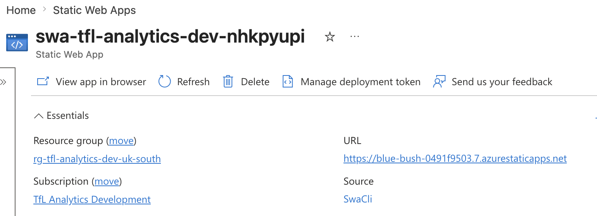
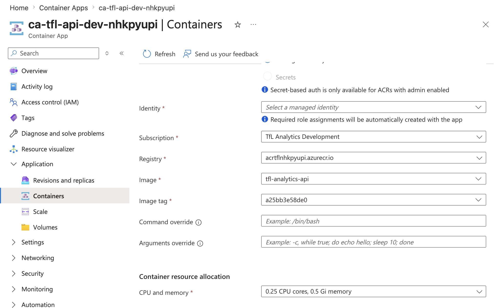
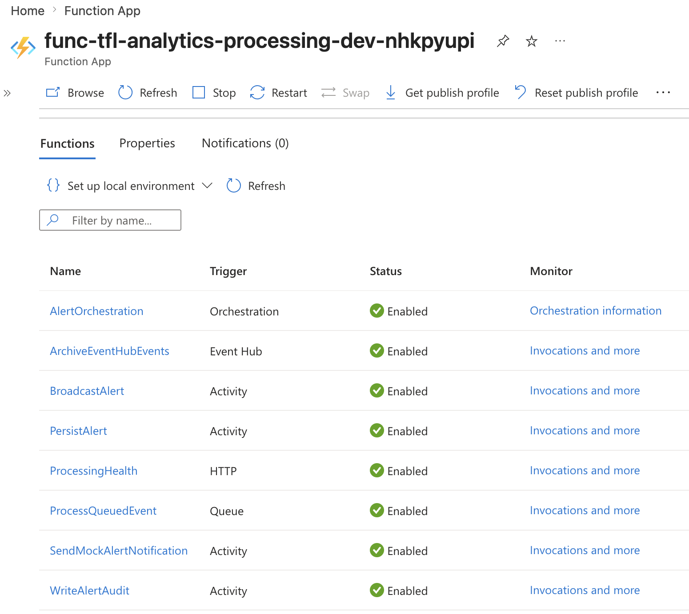
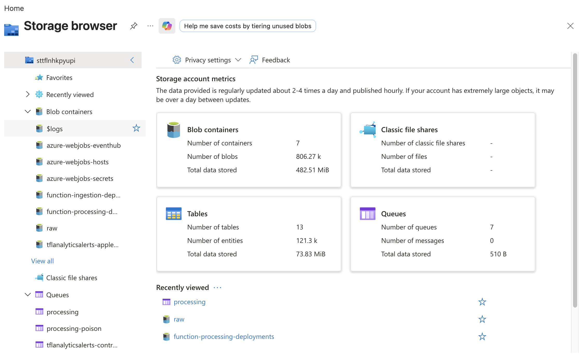

# TfL Live Analytics

A .NET 10 and Angular platform for ingesting Transport for London live data,
processing it through Azure services, and presenting real-time operational
analytics.

The detailed architecture is in [Plan.md](./Plan.md). Azure account, resource,
and Datadog guidance is in [plan-resources.md](./plan-resources.md).

## Architecture Diagrams

- [Azure event and data flow](./docs/plan/architecture-diagram.md) shows how
  arrival, line-status, alert, and audit data move through Functions, Event
  Hubs, Storage, Cosmos DB, Azure SQL, SignalR, and the dashboard.
- [API and dashboard architecture](./docs/plan/api-dashboard-architecture.md)
  explains how Angular and the ASP.NET Core Web API are hosted in Azure, how
  REST queries reach the data stores, and how SignalR delivers live updates.

## Azure Services









## Repository

```text
src/
  TflAnalytics.Api/
  TflAnalytics.Application/
  TflAnalytics.Contracts/
  TflAnalytics.Infrastructure/
  TflAnalytics.Ingestion.Functions/
  TflAnalytics.Processing.Functions/
tests/
  TflAnalytics.UnitTests/
  TflAnalytics.IntegrationTests/
  TflAnalytics.AzureSmokeTests/
web/
  tfl-analytics-dashboard/
infra/
  bicep/
  local/
```

## Requirements

- .NET SDK 10
- Node.js 24
- Docker Desktop
- Azure CLI with Bicep
- Azure subscription for cloud deployment

Azure Functions and SQL Server containers run as `linux/amd64` under emulation
on Apple Silicon.

## Build And Test

```bash
dotnet build TflAnalytics.sln
dotnet test TflAnalytics.sln --no-build -m:1 --disable-build-servers
```

Run the local full-history secret and dependency scan:

```bash
./scripts/security-scan.sh
```

The scan redacts findings and never mounts the ignored local `.env` file into
the scanner container.

Build Angular locally through the Docker/Linux dashboard image:

```bash
docker compose \
  --env-file .env \
  -f infra/local/compose.yaml \
  --profile ui \
  build web
```

Dashboard development, testing, and Angular CLI commands are documented in the
[Angular dashboard README](./web/tfl-analytics-dashboard/README.md).

## Local Containers

Validate Compose:

```bash
docker compose \
  --env-file .env \
  -f infra/local/compose.yaml \
  config --quiet
```

Run the API against deterministic WireMock TfL data:

```bash
docker compose \
  --env-file .env \
  -f infra/local/compose.yaml \
  up --build wiremock api
```

Test it:

```bash
curl http://localhost:8080/health/live
curl http://localhost:8080/api/tfl/line-status/victoria,circle
```

Start all local dependencies and application services:

```bash
docker compose \
  --env-file .env \
  -f infra/local/compose.yaml \
  up --build
```

The ingestion Function polls the deterministic WireMock fixtures and publishes
to the local `tfl-events` Event Hub. The processing Function archives each raw
event to Azurite, queues it, validates it, persists it to Cosmos DB, and writes
alerts to SQL Server and Azurite Table Storage. The API queries those same local
stores. Station IDs, line IDs, schedules, and emulator settings are configured
in `infra/local/compose.yaml`.

Add Angular:

```bash
docker compose \
  --env-file .env \
  -f infra/local/compose.yaml \
  --profile ui \
  up --build
```

The `ui` profile builds Angular with `http://localhost:8080` as its API and
SignalR base URL. Processing Functions relay realtime messages to the API
container, which broadcasts them through the self-hosted `/hubs/dashboard` hub.

Add Datadog:

```bash
docker compose \
  --env-file .env \
  -f infra/local/compose.yaml \
  --profile observability \
  up --build
```

Local ports:

| Service | Port | Profile |
|---|---:|---|
| API | `8080` | default |
| Angular | `4200` | `ui` |
| WireMock | `8089` | default |
| Azurite Blob | `10000` | default |
| Azurite Queue | `10001` | default |
| Azurite Table | `10002` | default |
| Event Hubs health | `5300` | default |
| Event Hubs AMQP | `5672` | default |
| Event Hubs Kafka | `9092` | default |
| Cosmos DB gateway | `8081` | default |
| Cosmos DB readiness | `8082` | default |
| Cosmos DB explorer | `1234` | default |
| SQL Server | `1433` | default |
| Datadog APM | `8126` | `observability` |
| DogStatsD | `8125/udp` | `observability` |

Service-by-service verification commands are documented in
[Local Smoke Tests](./docs/local-smoke-tests.md).

Datadog logs, APM, DogStatsD, and current instrumentation status are documented
in the [Datadog Agent guide](./docs/datadog-agent.md).

Known local environment fixes are documented in
[Troubleshooting](./docs/troubleshooting.md).

Stop containers while preserving volumes:

```bash
docker compose --env-file .env -f infra/local/compose.yaml down
```

## Azure Foundation

Resource group:

```text
rg-tfl-analytics-dev-uk-south
```

Deployed resources:

| Resource | Name |
|---|---|
| ADLS Gen2 storage | `sttflnhkpyupi` |
| Key Vault | `kv-tfl-nhkpyupi` |
| Event Hubs namespace | `evhns-tfl-analytics-dev-nhkpyupi` |
| Event hub | `tfl-events` |
| Log Analytics | `log-tfl-analytics-dev-nhkpyupi` |
| Application Insights | `appi-tfl-analytics-dev-nhkpyupi` |
| Container registry | `acrtflnhkpyupi` |
| Container Apps environment | `cae-tfl-analytics-dev-nhkpyupi` |
| API Container App | `ca-tfl-api-dev-nhkpyupi` |
| Ingestion Function App | `func-tfl-analytics-ingestion-dev-nhkpyupi` |
| Processing Function App | `func-tfl-analytics-processing-dev-nhkpyupi` |
| Static Web App | `swa-tfl-analytics-dev-nhkpyupi` |
| Cosmos DB account | `cosmos-tfl-analytics-dev-nhkpyupi` |
| Azure SQL server | `sql-tfl-analytics-dev-nhkpyupi` |
| Azure SQL database | `tfl-analytics` |
| Azure SignalR Service | `sigr-tfl-analytics-dev-nhkpyupi` |

Azure API:

```text
https://ca-tfl-api-dev-nhkpyupi.livelypebble-dde4d540.uksouth.azurecontainerapps.io
```

Azure dashboard:

```text
https://blue-bush-0491f9503.7.azurestaticapps.net
```

Validation, deployment, output discovery, and Azure smoke tests are documented
in the [Azure Bicep guide](./docs/azure-bicep.md).

The complete operator sequence is documented in the
[manual Azure deployment runbook](./docs/manual-deployment.md).

CI behavior is documented in the
[continuous integration guide](./docs/continuous-integration.md).

Validate Bicep:

```bash
az bicep build --file infra/bicep/main.bicep
```

Preview changes:

```bash
az deployment group what-if \
  --resource-group rg-tfl-analytics-dev-uk-south \
  --template-file infra/bicep/main.bicep \
  --parameters infra/bicep/environments/dev.bicepparam
```

Deploy:

```bash
az deployment group create \
  --resource-group rg-tfl-analytics-dev-uk-south \
  --template-file infra/bicep/main.bicep \
  --parameters infra/bicep/environments/dev.bicepparam
```

Publish, deploy, and smoke-test both Function packages:

```bash
./scripts/deploy-functions.sh
```

## Secrets

`.env` is ignored. Start from `.env.example` and never commit real values.

Azure Key Vault currently contains:

```text
TflApi--AppKey
Datadog--ApiKey
```

The double hyphen follows the convention used to map hierarchical .NET
configuration keys into Key Vault secret names.

## Delivery Status

Current phase status and deployment evidence are maintained in
[Plan.md](./Plan.md) and
[Azure Post-Deployment Verification](./docs/post-deployment-verification.md).
