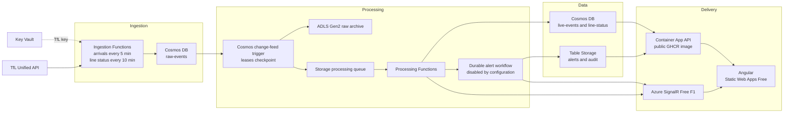

# Azure Event And Data Flow

> [Documentation index](../README.md)

This is the current reduced-cost Azure flow. The previous Event Hubs diagram is
retained as [historical context](../history/architecture-diagram-legacy.html).

