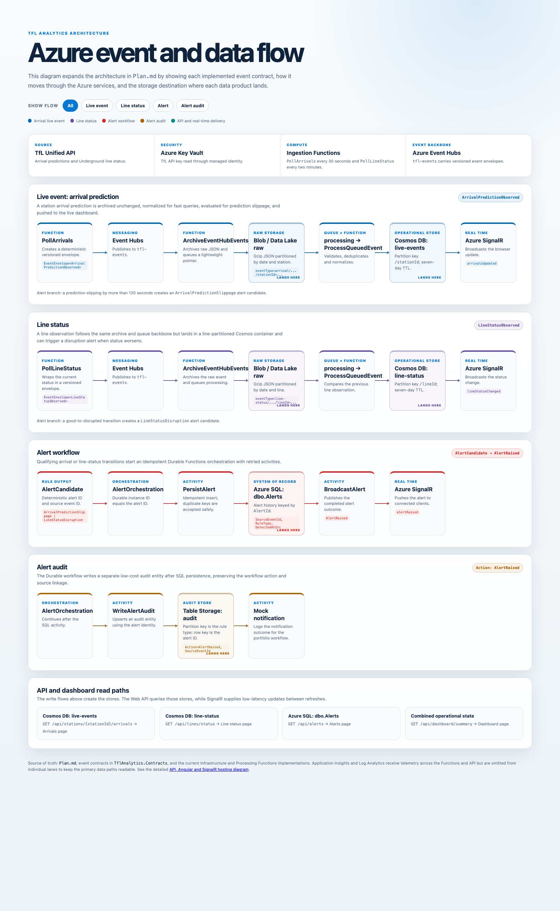

# Azure Event And Data Flow

> **Current-state note (updated 2026-07-04):** the diagram image below predates the
> 2026-06-27 transport change and still shows Event Hubs. The deployed event
> transport is now the **Cosmos DB change feed** (ingestion → `raw-events` container
> → Cosmos DB trigger, position tracked in `leases`); **Azure SQL was removed**
> (alerts use Table Storage); and the **API image is on public GHCR**. See
> `docs/cosmos-change-feed-migration.md` and `docs/azure-bicep.md`.

Source: [interactive HTML diagram](./architecture-diagram.html).
