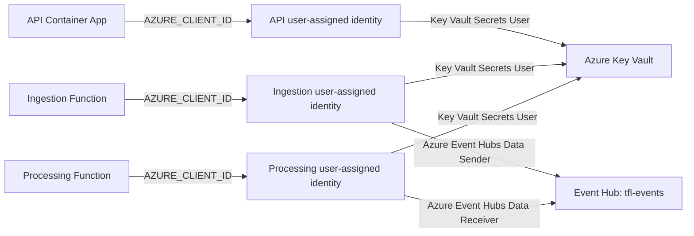

# Azure Workload RBAC

TfL Analytics uses user-assigned managed identities and Azure role-based access
control instead of service access keys or connection strings.

The workload RBAC implementation is defined in:

```text
infra/bicep/modules/workload-rbac.bicep
```

## Access Matrix

| Workload | Resource scope | Role | Purpose |
|---|---|---|---|
| Ingestion Function | `tfl-events` Event Hub | Azure Event Hubs Data Sender | Publish versioned TfL events |
| Processing Function | `tfl-events` Event Hub | Azure Event Hubs Data Receiver | Consume published TfL events |
| API | Key Vault | Key Vault Secrets User | Read application secrets |
| Ingestion Function | Key Vault | Key Vault Secrets User | Read the TfL and Datadog keys |
| Processing Function | Key Vault | Key Vault Secrets User | Read required processing secrets |

The Event Hubs assignments are scoped to the individual event hub rather than
the whole namespace. The Key Vault role can read secret values but cannot
create, update, delete, recover, or purge secrets.

## Identity Flow



## Role Definition IDs

The Bicep module references Azure built-in roles by stable definition ID:

```bicep
var eventHubsDataSenderRoleDefinitionId = subscriptionResourceId(
  'Microsoft.Authorization/roleDefinitions',
  '2b629674-e913-4c01-ae53-ef4638d8f975'
)

var eventHubsDataReceiverRoleDefinitionId = subscriptionResourceId(
  'Microsoft.Authorization/roleDefinitions',
  'a638d3c7-ab3a-418d-83e6-5f17a39d4fde'
)

var keyVaultSecretsUserRoleDefinitionId = subscriptionResourceId(
  'Microsoft.Authorization/roleDefinitions',
  '4633458b-17de-408a-b874-0445c86b69e6'
)
```

Using IDs avoids deployment failures caused by localized or renamed role
display names.

## Existing Resource References

The RBAC module receives deployed resource names and treats the Event Hubs
namespace, event hub, and Key Vault as existing resources:

```bicep
resource eventHubsNamespace 'Microsoft.EventHub/namespaces@2024-01-01' existing = {
  name: eventHubsNamespaceName
}

resource eventHub 'Microsoft.EventHub/namespaces/eventhubs@2024-01-01' existing = {
  parent: eventHubsNamespace
  name: eventHubName
}

resource keyVault 'Microsoft.KeyVault/vaults@2023-07-01' existing = {
  name: keyVaultName
}
```

This separates resource creation from permission assignment while preserving
Bicep dependency tracking.

## Deterministic Assignments

Each role-assignment name is generated from its scope, principal, and role:

```bicep
resource ingestionEventHubSender 'Microsoft.Authorization/roleAssignments@2022-04-01' = {
  name: guid(eventHub.id, ingestionPrincipalId, eventHubsDataSenderRoleDefinitionId)
  scope: eventHub
  properties: {
    principalId: ingestionPrincipalId
    principalType: 'ServicePrincipal'
    roleDefinitionId: eventHubsDataSenderRoleDefinitionId
  }
}
```

This makes deployments idempotent. Deploying the same principal, role, and
scope again produces the same assignment name.

Managed identities appear as `ServicePrincipal` objects in Microsoft Entra ID,
which is why `principalType` uses that value.

## Selecting The Correct Identity

The Function Apps have both system-assigned and user-assigned identities.
Without explicit selection, `DefaultAzureCredential` may not know which managed
identity should request the token.

Each host receives the client ID of its user-assigned identity:

```bicep
{
  name: 'AZURE_CLIENT_ID'
  value: ingestionIdentity.properties.clientId
}
```

Equivalent settings exist for the processing Function and API Container App.
Azure Identity SDK clients can then use `DefaultAzureCredential` without
storing a client secret.

The Functions also set the same client ID for host storage:

```text
AzureWebJobsStorage__credential=managedidentity
AzureWebJobsStorage__clientId=<user-assigned identity client ID>
```

## Secret Access

The current Key Vault secret names are:

```text
TflApi--AppKey
Datadog--ApiKey
```

The Bicep deployment grants permission but does not retrieve or expose either
value. Application configuration should use the Key Vault name and managed
identity to request secrets at runtime.

Do not place secret values in Bicep parameters, app settings, deployment
outputs, logs, or repository files.

## Deployment

Compile, preview, validate, and deploy the main Bicep template:

```bash
az bicep build --file infra/bicep/main.bicep

az deployment group what-if \
  --resource-group rg-tfl-analytics-dev-uk-south \
  --template-file infra/bicep/main.bicep \
  --parameters infra/bicep/environments/dev.bicepparam

az deployment group validate \
  --resource-group rg-tfl-analytics-dev-uk-south \
  --template-file infra/bicep/main.bicep \
  --parameters infra/bicep/environments/dev.bicepparam

az deployment group create \
  --name phase1-workload-rbac \
  --resource-group rg-tfl-analytics-dev-uk-south \
  --template-file infra/bicep/main.bicep \
  --parameters infra/bicep/environments/dev.bicepparam
```

RBAC assignments do not add a service charge.

## Verification

Run the repository smoke test:

```bash
./scripts/smoke-azure-workload-rbac.sh
```

It verifies:

- Every expected role, principal, and scope tuple exists exactly once.
- The API Container App uses the API identity client ID.
- The ingestion Function uses the ingestion identity client ID.
- The processing Function uses the processing identity client ID.
- No Key Vault secret values are read.

Expected result:

```text
Azure workload RBAC smoke tests passed:
  Ingestion identity: Event Hubs sender and Key Vault secret reader
  Processing identity: Event Hubs receiver and Key Vault secret reader
  API identity: Key Vault secret reader
  All hosts select the matching user-assigned identity through AZURE_CLIENT_ID
```

## Troubleshooting

Role assignments can take several minutes to propagate after deployment. If a
workload initially receives HTTP `401` or `403`:

1. Confirm the assignment exists with the smoke script.
2. Confirm `AZURE_CLIENT_ID` matches the intended user-assigned identity.
3. Restart or redeploy the workload after role propagation.
4. Check that the SDK requests the expected data-plane audience.
5. Confirm the role scope is the resource being accessed.

Do not solve authorization failures by adding `Owner`, `Contributor`, Event Hubs
Data Owner, Key Vault Administrator, or account access keys unless the workload
genuinely requires those broader capabilities.
