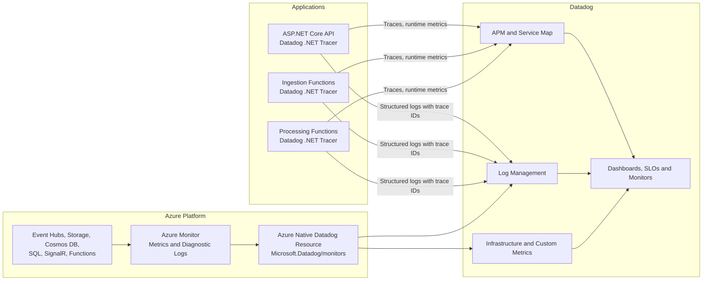

# Azure Resources and Datadog Observability Plan

## Purpose

This plan covers the prerequisites and resources needed before implementing the
TfL analytics platform described in [Plan.md](./Plan.md). It also defines how
Azure logs, platform metrics, application metrics, distributed traces, and APM
data will be collected and correlated in Datadog.

Datadog will be the primary observability interface. Azure Monitor remains
enabled as the source for Azure platform metrics, subscription activity logs,
and resource diagnostic logs.

## Account Setup

### 1. Create the Azure Account

Create an [Azure free account](https://azure.microsoft.com/pricing/purchase-options/azure-account)
if eligible. Microsoft currently advertises:

- USD 200 credit for the first 30 days.
- Monthly free amounts for selected services.
- Spending protection until the account is explicitly upgraded to pay-as-you-go.

Account setup requires:

- A Microsoft account.
- Phone verification.
- A credit or debit card for identity verification.
- A new Entra ID tenant or access to an existing tenant.

After signup:

1. Record the tenant ID and subscription ID.
2. Rename the subscription to something recognizable, such as
   `TfL Analytics Development`.
3. Keep the subscription spending limit enabled during initial development.
4. Create a monthly budget before deploying any resources.
5. Configure budget notifications at 50%, 80%, and 100%.
6. Register the resource providers required by the Bicep deployment:
   - `Microsoft.Web`
   - `Microsoft.Storage`
   - `Microsoft.EventHub`
   - `Microsoft.DocumentDB`
   - `Microsoft.Sql`
   - `Microsoft.SignalRService`
   - `Microsoft.KeyVault`
   - `Microsoft.Insights`
   - `Microsoft.OperationalInsights`
   - `Microsoft.Datadog`
   - `Microsoft.ManagedIdentity`
   - `Microsoft.Quota`
   - `Microsoft.App`
   - `Microsoft.ContainerRegistry`

Use a dedicated resource group:

```text
rg-tfl-analytics-dev-uk-south
```

The Phase 1 foundation and compute resources deployed by June 12, 2026 use:

| Resource | Name |
|---|---|
| ADLS Gen2 storage | `sttflnhkpyupi` |
| Key Vault | `kv-tfl-nhkpyupi` |
| Event Hubs namespace | `evhns-tfl-analytics-dev-nhkpyupi` |
| Event hub | `tfl-events` |
| Log Analytics | `log-tfl-analytics-dev-nhkpyupi` |
| Application Insights | `appi-tfl-analytics-dev-nhkpyupi` |
| Container registry | `acrtflnhkpyupi` |
| Container Apps environment | `cae-tfl-analytics-dev-nhkpyupi` |
| API Container App | `ca-tfl-api-dev-nhkpyupi` |
| Ingestion Function App | `func-tfl-analytics-ingestion-dev-nhkpyupi` |
| Processing Function App | `func-tfl-analytics-processing-dev-nhkpyupi` |
| Static Web App | `swa-tfl-analytics-dev-nhkpyupi` |

Default deployment region:

```text
UK South
```

Where a selected SKU is unavailable in UK South, use UK West and document the
exception in the Bicep parameter file.

### 2. Install Local Azure Tooling

Install and authenticate:

```bash
az login
az account set --subscription "<subscription-id>"
az bicep install
az bicep version
```

Use personal interactive login for the current script-driven deployments.
If Azure deployment is automated later, use GitHub Actions workload identity
federation instead of a stored Azure client secret.

### 3. Create or Link a Datadog Account

Use **Datadog - An Azure Native ISV Service** from Azure Marketplace. This is
preferred over manually creating an Azure app registration because it provides:

- A `Microsoft.Datadog/monitors` Azure resource.
- Azure platform metric collection through a managed identity.
- Automated Azure diagnostic log forwarding.
- Microsoft Entra ID single sign-on to Datadog.
- Datadog billing through the Azure subscription.
- Resource filtering using Azure tags.

Before accepting the Marketplace offer:

1. Review the Datadog trial duration and selected paid plan.
2. Confirm the Datadog site assigned to the organization, for example
   `datadoghq.com` or `datadoghq.eu`.
3. Set a separate Datadog usage budget and alerts.
4. Use one Datadog organization for local, development, and future production
   data, separated by the `env` tag.

Datadog is a separate paid service. Azure free credit does not imply unlimited
Datadog log, APM, or custom-metric ingestion.

## Resource Inventory

| Resource | Development choice | Purpose | Main cost control |
|---|---|---|---|
| Resource group | One development group | Deployment and teardown boundary | Delete the group when unused |
| Key Vault | Standard | TfL and Datadog secrets | Soft-delete; avoid excessive secret operations |
| Storage/ADLS Gen2 | Standard LRS | Raw events, queues, tables, Function state | Lifecycle rules and 30-day raw retention |
| Event Hubs | Basic or lowest compatible tier | Streaming event transport | One namespace and one hub |
| Functions | Consumption/Flex Consumption after compatibility validation | Polling, processing, Durable workflows | Execution limits and low polling volume |
| Cosmos DB | Free-tier serverless or free provisioned throughput | Recent operational events | Seven-day TTL and partition-aware queries |
| Azure SQL | Serverless free offer in Central US | Alerts and aggregates | Auto-pause at free-limit exhaustion and 32 GB limit |
| SignalR | Free tier where available | Dashboard updates | One unit and connection limits |
| Container Apps | Consumption | ASP.NET Core API | Scale to zero; maximum two replicas |
| Container Registry | Basic | Private API images | Remove unused tags and registry when the project is inactive |
| Static Web Apps | Free | Angular hosting | Free-tier limits |
| Azure Monitor | Minimal retention | Platform diagnostic source | Do not duplicate high-volume application logs |
| Datadog Native resource | Trial/development plan | Unified observability | Exclusion filters, sampling, and retention |

Exact prices and free allowances must be checked with the Azure and Datadog
pricing calculators immediately before deployment because offers and regional
availability change.

## Observability Architecture



### Telemetry Ownership

- **Datadog APM:** application requests, Function executions, HTTP calls, Azure
  SDK operations, SQL calls, errors, runtime metrics, and custom spans.
- **Datadog Logs:** structured application logs, Azure activity logs, and selected
  Azure resource diagnostic logs.
- **Datadog Metrics:** Azure platform metrics, .NET runtime metrics, trace-derived
  metrics, and a controlled set of custom business metrics.
- **Azure Monitor:** source for Azure platform telemetry and short-term
  troubleshooting; it is not the main dashboard.
- **Application Insights:** retain the resource only if an Azure component
  requires it operationally. Do not enable a second application auto-instrumentation
  agent when Datadog APM is enabled.

The .NET CLR Profiling API permits one profiler subscriber. Datadog automatic
instrumentation must therefore be the only CLR profiler attached to each process.

## Unified Service Tagging

Every log, trace, metric, container, and Azure resource must carry:

```text
service
env
version
team
project
region
```

Standard values:

| Component | `DD_SERVICE` |
|---|---|
| ASP.NET Core API | `tfl-analytics-api` |
| Ingestion Functions | `tfl-analytics-ingestion` |
| Processing Functions | `tfl-analytics-processing` |
| Angular RUM, if added later | `tfl-analytics-web` |

Shared environment variables:

```text
DD_ENV=dev
DD_VERSION=<git-sha-or-release>
DD_SITE=<organization-site>
DD_LOGS_INJECTION=true
DD_RUNTIME_METRICS_ENABLED=true
DD_TRACE_ENABLED=true
DD_TRACE_HEALTH_METRICS_ENABLED=true
DD_TAGS=team:personal,project:tfl-analytics,region:uksouth
```

Never bake `DD_API_KEY` into a Docker image, source file, Bicep parameter file,
or GitHub Actions variable. Store it in:

- An uncommitted local `.env` or Docker secret for local development.
- Azure Key Vault for deployed workloads.
- A GitHub Actions secret only if deployment automation must configure Datadog.

## Datadog .NET Tracer SDK Plan

### Package Strategy

Add `Datadog.Trace.Bundle` to each executable .NET service:

- `TflAnalytics.Api`
- `TflAnalytics.Ingestion.Functions`
- `TflAnalytics.Processing.Functions`

Add `Datadog.Trace` directly only where custom spans are required. Keep
`Datadog.Trace.Bundle` and `Datadog.Trace` on exactly the same tracer version and
pin that version centrally in dependency management.

Do not add Datadog packages to pure contracts or domain projects.

Before implementation, verify that the selected tracer release explicitly
supports the project's .NET 10 runtime and the chosen Azure Functions hosting
model. If support is not yet available, target the current supported .NET LTS
runtime for deployable services while retaining domain code compatibility.

### Automatic Instrumentation

Automatic instrumentation should cover:

- ASP.NET Core inbound requests.
- `HttpClient` calls to TfL.
- Azure SDK calls where supported.
- SQL client and Entity Framework Core operations.
- Cosmos DB client operations where supported.
- Error and exception tagging.
- W3C distributed trace-context propagation.

Linux containers will install the Datadog native tracer under `/opt/datadog` and
set:

```text
CORECLR_ENABLE_PROFILING=1
CORECLR_PROFILER={846F5F1C-F9AE-4B07-969E-05C26BC060D8}
CORECLR_PROFILER_PATH=/opt/datadog/Datadog.Trace.ClrProfiler.Native.so
DD_DOTNET_TRACER_HOME=/opt/datadog
```

Use a Debian/Ubuntu-based .NET runtime image initially. Alpine, chiseled, and
distroless images require different native tracer packaging and should be
considered only after the basic integration is proven.

### Custom Spans

Create custom spans only around important business operations not represented
well by automatic instrumentation:

```text
tfl.poll.arrivals
tfl.poll.line_status
event.publish
event.normalize
event.deduplicate
raw_event.archive
alert.evaluate
alert.orchestrate
signalr.broadcast
```

Allowed low-cardinality span tags:

```text
station_id
line_id
event_type
schema_version
alert_rule
result
```

Do not tag spans or metrics with vehicle IDs, event IDs, raw URLs containing
keys, passenger data, exception stack traces, or full TfL payloads. High-cardinality
values may be placed in sampled logs when genuinely needed.

The TfL `app_key` query value must be removed from request URLs before traces and
logs are exported.

### Sampling

Initial development settings:

```text
DD_TRACE_SAMPLE_RATE=1.0
DD_TRACE_RATE_LIMIT=100
```

For a continuously running environment:

- Retain all error and alert traces.
- Reduce normal polling and health-check traces using Datadog sampling rules.
- Exclude `/health/live` and `/health/ready` from trace ingestion.
- Start with 20% sampling for successful polling traces and revisit after
  measuring volume.

Sampling configuration must be environment-specific rather than compiled into
application code.

## Logs Plan

### Application Logs

Use `Microsoft.Extensions.Logging` with JSON console output. Each record should
include:

```text
timestamp
level
message
service
env
version
trace_id
span_id
event_type
station_id
line_id
operation
duration_ms
result
```

`DD_LOGS_INJECTION=true` will inject Datadog trace and span identifiers into
supported .NET logging providers, allowing navigation from a trace to its logs.

Logging rules:

- Log one structured completion event per important operation.
- Avoid logging every arrival prediction at information level.
- Use debug logs locally and information/warning/error in Azure.
- Never log the TfL key, Datadog key, Azure connection strings, bearer tokens,
  or complete raw TfL responses.
- Store raw responses in ADLS rather than Datadog Logs.
- Apply Datadog sensitive-data scanning or masking rules as a second safeguard.

### Azure Platform Logs

The Datadog Native Azure resource will forward:

- Azure subscription activity logs.
- Function and App Service platform logs.
- Event Hubs operational and error logs.
- Storage service logs needed for failures and throttling.
- Cosmos DB request/error diagnostics.
- Azure SQL errors, timeouts, and security audit events.
- Key Vault audit events.
- SignalR connectivity and error logs.

Use resource tags and Datadog inclusion rules so only resources tagged
`observability:datadog` and `env:dev` are forwarded.

Do not enable every diagnostic category by default. Begin with operational,
error, audit, and throttling categories; add verbose request logs only during a
time-limited investigation.

## Metrics Plan

### Azure Platform Metrics

Collect through the Azure Native Integration:

- Function execution count, duration, errors, throttles, and memory.
- Event Hubs incoming/outgoing messages, throttled requests, and consumer lag
  where available.
- Queue depth, oldest-message age, and poison-message count.
- Storage transactions, latency, errors, and capacity.
- Cosmos DB RU consumption, throttled requests, latency, and availability.
- Azure SQL CPU, data IO, sessions, storage, and failed connections.
- SignalR connections, messages, errors, and quota utilization.
- App Service or Container Apps request, CPU, memory, restart, and replica data.

### .NET Runtime Metrics

Enable Datadog runtime metrics for:

- Garbage collection count and pause time.
- Heap size and allocation rate.
- Thread pool queue length and worker threads.
- Exceptions.
- Lock contention.
- Process CPU and memory.

### Custom Business Metrics

Submit custom metrics through DogStatsD when an Agent or supported Datadog
extension is available:

```text
tfl.poll.count
tfl.poll.duration
tfl.poll.error
tfl.arrivals.observed
tfl.events.published
tfl.events.processed
tfl.events.duplicate
tfl.processing.lag
tfl.alerts.raised
tfl.signalr.broadcast
```

Allowed metric tags are limited to `env`, `service`, `event_type`, `line_id`,
`station_id`, `result`, and `alert_rule`. Event IDs and vehicle IDs are forbidden
as metric tags.

Use distributions for latency and lag. Use counters for events and alerts. Avoid
creating duplicate custom metrics when an equivalent Azure or trace-derived
metric already exists.

## Local Docker Integration

Add a Datadog Agent container to the `observability` Docker Compose profile:

```text
datadog-agent
  - APM receiver: TCP 8126
  - DogStatsD: UDP 8125
  - Docker socket: read-only
  - Container log collection: enabled
```

Application containers send:

- Traces to `datadog-agent:8126`.
- Custom metrics to `datadog-agent:8125`.
- Structured logs to standard output for Agent collection.

Local environment variables:

```text
DD_AGENT_HOST=datadog-agent
DD_TRACE_AGENT_PORT=8126
DD_DOGSTATSD_PORT=8125
DD_LOGS_INJECTION=true
DD_RUNTIME_METRICS_ENABLED=true
```

The Agent container receives the API key at runtime from an uncommitted `.env`
file or Docker secret. `.env.example` contains names and placeholders only.

Provide two observability modes:

- `observability-local`: OpenTelemetry Collector and a local trace backend, no
  Datadog account required.
- `observability-datadog`: Datadog Agent sends local integration-test telemetry
  to the Datadog development environment.

Deterministic integration tests must not depend on Datadog SaaS availability.
They validate instrumentation fields using captured OTLP or test exporters.

## Azure Hosting Integration

### Azure Native Integration

Provision `Microsoft.Datadog/monitors` in Bicep or deploy it once through Azure
Marketplace and reference it from infrastructure configuration.

Configure:

- Entra ID SSO.
- Monitoring Reader role on the development subscription.
- Resource collection restricted by tags where supported.
- Subscription activity-log forwarding.
- Selected resource diagnostic-log forwarding.
- Azure platform metric collection.

### API Hosting

For App Service, use the supported Datadog App Service extension and configure
unified service tags as application settings.

For a custom container host, package the .NET tracer in the image and send traces,
metrics, and logs through the hosting option supported by Datadog for that Azure
service. Validate this path with a smoke test before standardizing on App Service
or Container Apps.

### Azure Functions

Use Datadog's supported Azure Functions/serverless integration for the selected
hosting plan. Confirm all of the following before deployment:

- .NET isolated worker support.
- .NET runtime version support.
- Trigger and binding trace coverage.
- Durable Functions trace behavior.
- Availability of log injection and runtime metrics.
- How API keys and Datadog site settings are supplied.

If the selected Consumption plan cannot provide the required APM support, choose
one of these fallbacks in order:

1. Host the Functions as Linux custom containers on a compatible Functions plan.
2. Use Azure Container Apps jobs/services for polling and processing.
3. Keep Azure platform logs and metrics in Datadog and instrument business
   operations with OpenTelemetry until native tracer support is available.

## Dashboards, Monitors, and SLOs

Create one Datadog overview dashboard containing:

- TfL API success rate and latency.
- Arrival and line-status poll freshness.
- Events published and processed per minute.
- End-to-end processing lag.
- Event Hubs throughput and throttling.
- Queue depth and poison messages.
- Cosmos DB RU use and throttles.
- SQL health.
- Function/API errors and p95 duration.
- Active SignalR clients and broadcast failures.
- Alerts raised by rule, station, and line.
- Azure and Datadog estimated usage.

Initial monitors:

| Monitor | Initial condition |
|---|---|
| No successful arrival poll | No success for 2 minutes |
| No successful line-status poll | No success for 5 minutes |
| TfL API error rate | More than 10% over 5 minutes |
| Processing lag | p95 above 60 seconds for 10 minutes |
| Queue backlog | Depth or oldest age exceeds normal operating threshold |
| Poison messages | Any new poison message |
| Cosmos throttling | Sustained HTTP 429 responses |
| API availability | Error rate above 2% or p95 latency above 1 second |
| Durable workflow failures | Any unhandled orchestration failure |
| SignalR failures | Sustained publish errors |
| Datadog ingestion silence | Expected service emits no telemetry |
| Azure budget | 50%, 80%, and 100% thresholds |

Initial SLOs:

- API availability: 99.5% over 30 days.
- Successful scheduled polling: 99% over 7 days.
- Arrival freshness: 95% available to the dashboard within 45 seconds.
- Line-status freshness: 95% available within 150 seconds.
- Processing latency: 95% of events persisted within 30 seconds.

## Cost and Data Governance

Datadog cost risk is driven mainly by indexed logs, APM trace ingestion/retention,
custom metric cardinality, and monitored containers/hosts.

Controls:

- Use development-only resource and log inclusion filters.
- Exclude health checks and successful high-frequency polling logs.
- Sample normal traces while retaining errors.
- Keep metric tags low-cardinality.
- Use a short log retention period for the development environment.
- Archive raw payloads to ADLS, not Datadog.
- Add daily usage dashboards and weekly usage review.
- Configure Datadog usage alerts before enabling broad log forwarding.
- Stop or delete unused Azure resources and local Agent containers.

## Delivery Order

### Phase 1: Accounts and Guardrails

1. Create the Azure account and subscription.
2. Keep spending protection enabled initially.
3. Create Azure budgets and notifications.
4. Create or link Datadog through Azure Native ISV Service.
5. Confirm Datadog site, trial/plan, and usage notifications.
6. Rotate the previously shared TfL key.

### Phase 2: Local Observability

1. Add the Datadog Agent to the Docker Compose observability profile.
2. Configure JSON application logs.
3. Install and pin the compatible Datadog .NET tracer.
4. Enable automatic tracing, runtime metrics, and log injection.
5. Add custom spans and low-cardinality business metrics.
6. Verify trace-log correlation without depending on Azure.

### Phase 3: Azure Platform Integration

1. Deploy the development Azure resources using Bicep.
2. Tag monitored resources consistently.
3. Configure Datadog Native metric collection.
4. Selected Azure diagnostic categories are deployed to Log Analytics.
5. Install the supported Datadog App Service and Functions integrations.
6. Verify end-to-end traces across API, Functions, Event Hubs, storage, and SQL.

### Phase 4: Operational Readiness

1. Create dashboards, monitors, and SLOs.
2. Test failure scenarios and verify notifications.
3. Tune sampling, exclusions, and retention from observed volume.
4. Add observability smoke tests to deployment automation.
5. Document incident triage and telemetry-loss procedures.

## Validation Checklist

- Azure budget alerts are delivered successfully.
- Datadog receives Azure platform metrics and selected diagnostic logs.
- Each .NET service appears under the expected `service`, `env`, and `version`.
- One user request can be followed across API, storage, and downstream processing.
- Logs contain valid Datadog trace and span IDs.
- Exceptions link from traces to structured logs.
- The TfL key and Datadog API key do not appear in telemetry.
- Runtime metrics are visible for every .NET process.
- Custom metrics contain no unbounded tags.
- Local Docker telemetry reaches the Agent.
- Integration tests still run when Datadog SaaS is unavailable.
- Duplicate Application Insights and Datadog application traces are not emitted.
- Dashboards and monitors are reproducible through code or exported configuration.

## References

- [Azure account options and free services](https://azure.microsoft.com/pricing/purchase-options/azure-account)
- [Datadog Azure Native Integration overview](https://learn.microsoft.com/azure/partner-solutions/datadog/overview)
- [Datadog Azure integration](https://docs.datadoghq.com/integrations/azure/)
- [Datadog .NET tracer](https://docs.datadoghq.com/tracing/trace_collection/dd_libraries/dotnet-core/)
- [Correlating .NET logs and traces](https://docs.datadoghq.com/tracing/other_telemetry/connect_logs_and_traces/dotnet/)
- [Datadog Agent for Docker](https://docs.datadoghq.com/containers/docker/)
- [Docker log collection](https://docs.datadoghq.com/containers/docker/log/)
